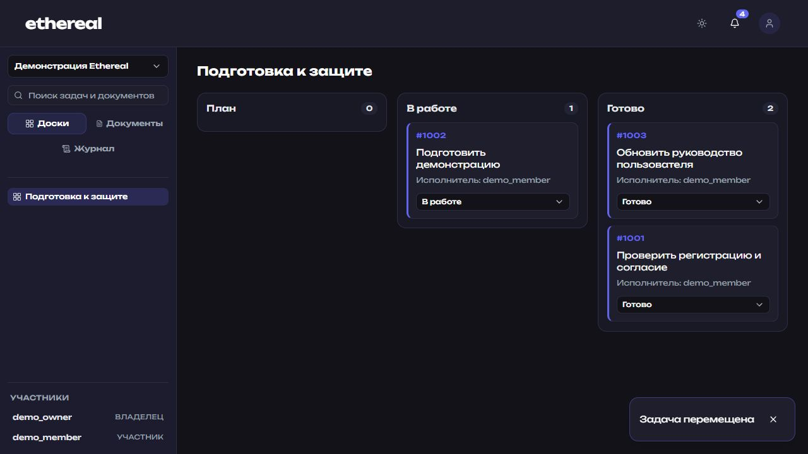
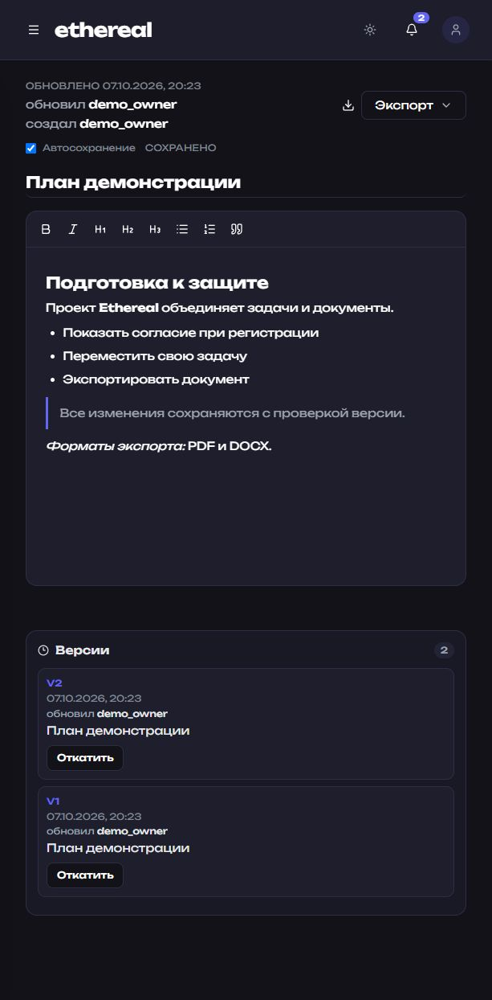

# Ethereal

Платформа для совместной работы: канбан-доски, задачи и документы с историей версий. Учебный проект на React + Zustand, FastAPI и PostgreSQL.

## Реализовано

- Регистрация с отдельным обязательным согласием и созданием личного пространства.
- Cookie-сессия: HttpOnly, SameSite=Lax, CSRF; обычный вход до 24 часов, запоминание до 30 дней. Выход и истечение синхронизируются между вкладками.
- Пространства, роли, приглашение существующего пользователя по логину.
- Доски, настраиваемые колонки, задачи и назначение исполнителя. Участник перемещает свои задачи выбором колонки.
- Отдельные деревья папок досок и документов, поиск с учётом доступа.
- Редактор с форматированием, локальные черновики, автосохранение, версии и восстановление.
- Проверка ревизий задач и документов: устаревшая запись возвращает 409; конфликт сохраняет черновик и останавливает автосохранение.
- Обновление доступного пространства раз в 10 секунд и при возврате на вкладку, без перезагрузки страницы. Скрытая вкладка приостанавливает проверку; ошибки увеличивают интервал до 60 секунд.
- Личные уведомления, прочитанность, журнал и общие сообщения о результатах действий.
- Экспорт текущего документа в PDF и DOCX с сохранением черновика перед выгрузкой.
- robots.txt, GitHub Actions и шаблон PR.

## Руководства

- [Frontend](frontend/README.md) и [backend](backend/README.md): запуск и проверки.
- [Архитектура и права](docs/architecture.md), [схема БД](docs/database.md), [API](docs/api.md).
- [Git-процесс](docs/development.md): ветки, PR, проверки и релиз.
- [Скриншоты и повторение демонстрации](docs/screenshots.md).
- Краткая документация в самом приложении: `/documentation`.



Участник видит назначенные задачи и меняет только их колонку.



Документ, форматирование, статус сохранения и история версий.

## Ограничения и развитие

Согласие и политика на `/consent` и `/privacy` — демонстрационные учебные тексты по 152-ФЗ. Реквизиты оператора и контакт задаются через `PRIVACY_OPERATOR` и `PRIVACY_CONTACT`; вымышленные данные не используются. Тексты не заменяют подготовку документов для публичного сервиса.

Приглашение добавляет уже зарегистрированного пользователя; подтверждения почты и почтовых рассылок нет. Уведомления работают внутри сайта. Синхронизация использует опрос API, поэтому 10 секунд — интервал проверки при доступном сервере, а не гарантированный срок доставки. Экспорт поддерживает текст, заголовки, списки, цитаты, выделение, ссылки и код; изображения и произвольный HTML не экспортируются. Восстановление создаёт новую версию со ссылкой на выбранную старую; вся история сохраняется.

Планы развития: импорт документов, расширенный поиск, уведомления по email, сравнение редакций и PWA. Эти возможности пока не реализованы.

## Запуск

Для локального запуска можно использовать значения по умолчанию:

```bash
docker compose up --build
```

Для запуска на сервере с HTTPS создай `.env` на основе [.env.example](.env.example):

```bash
cp .env.example .env
```

Домен должен указывать DNS-записью `A` на IP сервера. Порты `80` и `443` должны быть свободны и доступны из интернета. Сертификат должен быть в формате PEM; укажи пути к файлу полной цепочки и закрытому ключу на сервере:

```env
CORS_ORIGINS=https://example.com
SSL_CERT_FILE=/etc/letsencrypt/live/example.com/fullchain.pem
SSL_KEY_FILE=/etc/letsencrypt/live/example.com/privkey.pem
```

После этого запусти приложение:

```bash
docker compose -f docker-compose.yml -f docker-compose.server.yml up -d --build
```

Серверный compose публикует только gateway на порты `80` и `443`. Backend, frontend и PostgreSQL доступны только внутри Docker-сети. Gateway перенаправляет HTTP на HTTPS, проксирует API и использует подключённые файлы сертификата.

Файл `.env` не хранится в Git и останется на сервере после `git pull`. При старте backend автоматически применяет Alembic-миграции после готовности PostgreSQL.

После обновления на cookie-авторизацию потребуется повторный вход. Миграция сохраняет пользователей и содержимое, отзывает прежние сессии и не создаёт согласия за существующих пользователей. Перед обновлением сохраните резервную копию базы.

Ключ для шифрования паролей создаётся при первом запуске backend и хранится в отдельном Docker volume `authkeys`. Сохраняй этот volume при обновлениях сервера.

После запуска сайт доступен на `https://example.com`, API — под `/api/`, а документация API — на `https://example.com/api/docs` (адрес `/docs` перенаправляет туда). Замени `example.com` на свой домен.

При обновлении сертификата перезапусти gateway, чтобы Nginx перечитал файлы:

```bash
docker compose -f docker-compose.yml -f docker-compose.server.yml up -d --force-recreate gateway
```

Инструкции для отдельных частей проекта находятся в [backend/README.md](backend/README.md) и [frontend/README.md](frontend/README.md).
