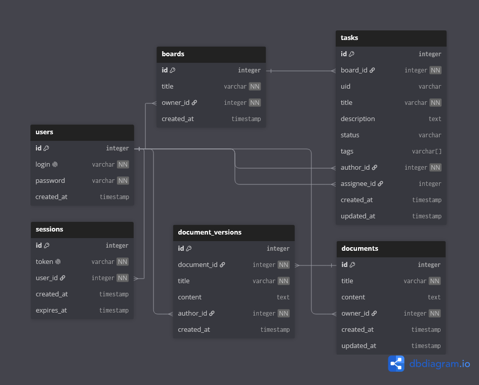

# Backend

Бэкенд для Ethereal на FastAPI и PostgreSQL. Авторизация, рабочие пространства, роли, доски, задачи, документы с версиями и журнал действий.

## Что умеет

Регистрация и вход работают по токену сессии. После регистрации пользователю создаётся личное рабочее пространство. Доски, задачи и документы принадлежат пространству, а доступ определяется членством.

В пространстве есть роли `owner`, `admin` и `member`. Владелец управляет пространством и ролями, администратор управляет участниками и структурой содержимого, участник работает с досками, задачами и документами. Основные операции фиксируются в журнале действий.

## Стек

- FastAPI - сам веб-сервер и роуты
- PostgreSQL - база данных
- SQLAlchemy (async) - работа с базой через asyncpg
- Alembic - миграции
- Pydantic - проверка данных на входе и выходе

## Схема БД

Интерактивно: https://dbdiagram.io/d/ethereal-notes-6a7eb27ae093539a9eb50c66

## Структура

- app/main.py - точка входа, при старте создаются таблицы
- app/config.py - читает настройки из .env
- app/database.py - подключение к базе и сессия
- app/models.py - users, sessions, workspaces, workspace_members, boards, tasks, documents, document_versions, activity_logs
- app/schemas.py - схемы данных для запросов и ответов
- app/crud.py - функции работы с базой
- app/security.py - хеш пароля и сессии
- app/routers/auth.py - адреса /auth
- app/routers/users.py - адреса /users
- app/routers/workspaces.py - адреса /workspaces, участники и журнал
- app/routers/boards.py - адреса /boards
- app/routers/tasks.py - адреса /tasks
- app/routers/documents.py - адреса /documents

## Поля пользователя

- login - логин
- password - хеш пароля
- created_at - когда зарегистрировался

## Поля доски

- title - название доски
- owner_id - кто создал
- workspace_id - рабочее пространство
- created_at - когда создали
- tasks - задачи этой доски

## Поля рабочего пространства

- name - название
- owner_id - владелец
- created_at - когда создали
- members - участники с ролями `owner`, `admin` или `member`

## Поля участника пространства

- workspace_id - рабочее пространство
- user_id - пользователь
- role - роль участника
- created_at - когда добавили

## Поля задачи

- board_id - к какой доске относится
- uid - номер задачи который видно
- title - что за задача
- description - подробное описание
- status - Открыта, В работе, На проверке, Готово
- tags - метки типа DEV, BUG
- author_id - кто создал
- assignee_id - кому назначено, может быть пусто
- created_at - когда создали
- updated_at - когда обновили

## Поля документа

- title - название
- content - текущий текст
- owner_id - кто создал
- workspace_id - рабочее пространство
- created_at / updated_at - даты
- versions - снимки: title, content, author_id, created_at

## Поля записи журнала

- workspace_id - рабочее пространство
- user_id - кто выполнил действие
- action - тип действия
- entity_type / entity_id - затронутая сущность
- title - название сущности на момент действия
- created_at - когда выполнили

## Адреса

- POST /auth/register - регистрация
- POST /auth/login - вход
- POST /auth/logout - выход
- GET /auth/me - текущий пользователь
- GET /users - список пользователей
- GET /users/{id} - один пользователь
- GET /workspaces - доступные пространства текущего пользователя
- POST /workspaces - создать пространство
- PATCH /workspaces/{id} - переименовать пространство
- DELETE /workspaces/{id} - удалить пространство вместе с содержимым
- GET /workspaces/{id}/members - список участников
- POST /workspaces/{id}/members - пригласить пользователя по логину
- PATCH /workspaces/{id}/members/{user_id} - изменить роль участника
- DELETE /workspaces/{id}/members/{user_id} - удалить участника
- GET /workspaces/{id}/activity - журнал действий пространства
- POST /boards - создать доску
- GET /boards?workspace_id= - доски пространства с задачами
- GET /boards/{id} - одна доска с задачами
- PATCH /boards/{id} - обновить
- DELETE /boards/{id} - удалить доску вместе с её задачами
- POST /tasks - создать задачу
- GET /tasks?board_id= - задачи доски
- GET /tasks/{id} - одна задача
- PATCH /tasks/{id} - обновить
- DELETE /tasks/{id} - удалить
- POST /documents - создать документ
- GET /documents?workspace_id= - документы пространства
- GET /documents/{id} - один документ
- PATCH /documents/{id} - обновить
- DELETE /documents/{id} - удалить
- POST /documents/{id}/versions - сохранить снимок
- POST /documents/{id}/restore/{version_id} - откатить

## Как запустить

Локально:

1. Зайти в папку backend
2. Поставить зависимости: pip install -r requirements.txt
3. Скопировать .env.example в .env и вписать свои данные базы
4. Запустить: uvicorn app.main:app --reload

Через Docker из корня репозитория: docker compose up --build

Фронт будет на http://localhost, API на http://localhost:8000, документация на http://localhost:8000/docs

## Тесты

Для установки зависимостей разработки: `pip install -r requirements-dev.txt`

Запуск из папки `backend`: `pytest -q`
