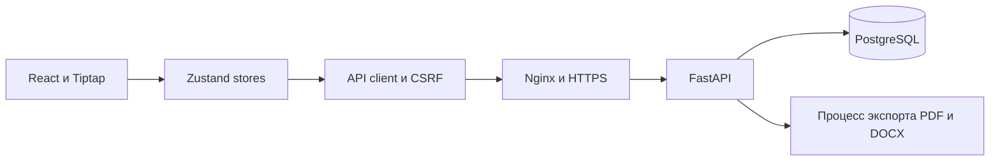

# Архитектура и права

## Компоненты

React Router разделяет публичные страницы и приватное пространство. При старте cookie проверяется сервером, затем загружаются доступные пространства. Ключ для шифрования пароля сохраняется в `authkeys`; пароль хранится как хеш. Cookie недоступна JavaScript, CSRF-токен хранится в памяти; небезопасные методы проверяют заголовок и разрешённый Origin. SameSite дополняет, а не заменяет CSRF-проверку. [Рекомендации OWASP](https://cheatsheetseries.owasp.org/cheatsheets/Cross-Site_Request_Forgery_Prevention_Cheat_Sheet.html).

Данные одного запроса сохраняются одной транзакцией. Зависимость БД завершается до отправки ответа (`scope="function"`); если уведомление или фиксация изменений не удались, действие откатывается. [Жизненный цикл зависимости FastAPI](https://fastapi.tiangolo.com/tutorial/dependencies/dependencies-with-yield/).

## Матрица прав

| Действие | Владелец | Администратор | Участник |
| --- | --- | --- | --- |
| Читать документы, версии и экспортировать | Да | Да | Да |
| Создавать, редактировать, удалять документы | Да | Да | Нет |
| Смотреть задачи | Все/исполнитель | Все/исполнитель | Только свои |
| Перемещать задачи выбором колонки | Любые | Любые | Только свои |
| Создавать, назначать, редактировать, удалять задачи | Да | Да | Нет |
| Управлять досками, колонками, папками | Да | Да | Нет |
| Переименовывать пространство, приглашать | Да | Да | Нет |
| Удалять участников | Кроме себя и владельца | Только обычного участника | Нет |
| Менять роль участника | Да, кроме владельца | Нет | Нет |
| Удалять пространство | Да, если есть другое своё | Нет | Нет |
| Читать журнал | Полный | Полный | Документы и доступные собственные задачи |
| Читать уведомления | Только личные | Только личные | Только личные |

Членство проверяется на каждом API-запросе. Скрытые объекты возвращают 404. Нельзя переместить задачу в колонку другой доски или менять содержимое собственной задачи с ролью участника.

## Обновление пространства

Клиент сверяет список сущностей и их ревизии через sync каждые 10 секунд. Скрытая вкладка не опрашивает сервер; возвращение запускает проверку сразу. После ошибок интервал увеличивается до 20/40/60 секунд и возвращается к 10 при успехе. Загружаются изменённые доски, документы и папки; отсутствующие идентификаторы удаляются. Участники и доступные пространства обновляются вместе со снимком.

Ссылки на неизменившиеся объекты сохраняются. Карточки и колонки используют memo. Локальные действия обновляют ответ API в store. Фоновая загрузка не включает общий экран загрузки и не сбрасывает открытое окно, фильтр или черновик. Запоздалые ответы от другой сессии, пространства и фильтра игнорируются.

`expected_revision` защищает задачу и документ от записи поверх чужих изменений. Для документа конфликт останавливает автосохранение; черновик остаётся в sessionStorage. «Загрузить серверную версию» отбрасывает локальные правки; «Сохранить мой текст» получает последнюю ревизию и повторяет сохранение с её проверкой. Это явное действие пользователя, а не автоматическое разрешение конфликта.

## Уведомления и экспорт

Приглашение и смена роли направляются затронутому пользователю; назначение — новому исполнителю; перемещение — исполнителю и руководителям пространства. Инициатор исключается, получатели дедуплицируются. Перед выдачей истории API повторно проверяет доступ к объекту: недоступные названия и ссылки скрываются. Прочитанность хранится в БД.

Экспорт берёт текущую сохранённую редакцию. Клиент сначала сохраняет черновик; конфликт останавливает выгрузку. Общий HTMLParser поддерживает только разрешённые элементы и безопасные схемы ссылок, не передаёт стилевые атрибуты или изображения. PDF генерируется WeasyPrint без загрузки внешних/локальных ресурсов, DOCX — python-docx. Ограничены размер входа, время и параллельность.

Согласие и политика являются учебной демонстрацией по [152-ФЗ «О персональных данных»](https://mintrud.gov.ru/docs/laws/130). Галочка снята изначально, запись принятия создаётся с серверным временем и версией вместе с пользователем и личным пространством. Для существующих пользователей согласия не добавляются.
