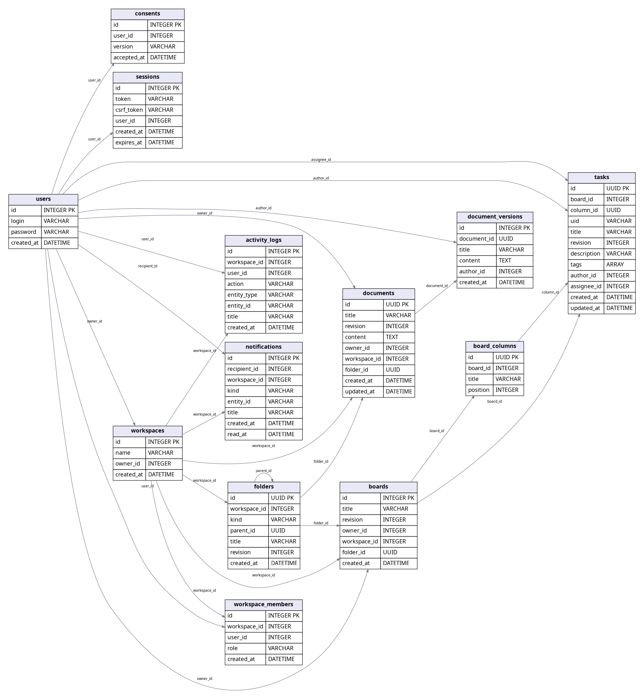
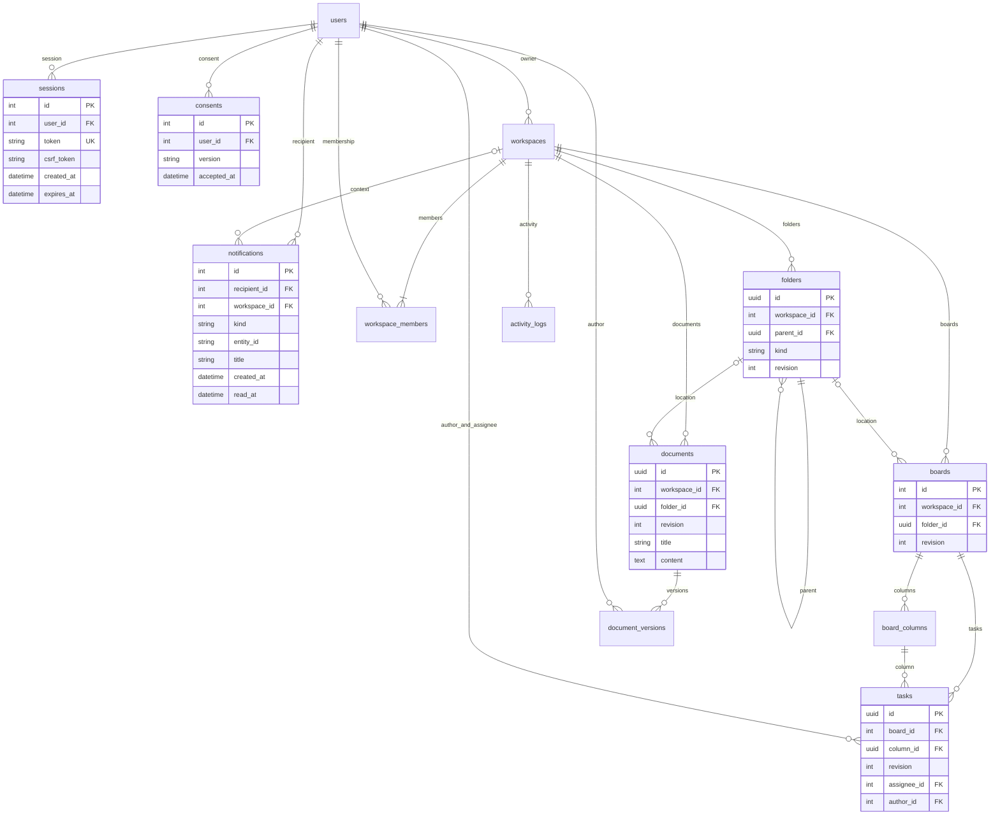

# Схема базы данных

Актуальный источник — `backend/app/models.py` и Alembic. Изображение построено по текущим таблицам и внешним ключам моделей. Ниже приведена схема связей.

Идентификаторы задач, документов, папок и колонок — UUID; досок, пространств, пользователей, журнала и версий — integer. Дата хранится как UTC без часового пояса и переводится в локальное время интерфейсом. Членство уникально по паре workspace_id/user_id; логин и токен сессии уникальны.

Ревизия начинается с 1. Task/Document/Folder используют версионную проверку SQLAlchemy; Board увеличивается атомарно при изменениях задачи и колонок. Сведения о принятии согласия содержат конкретную редакцию, без заполнения задним числом. Read_at=null означает непрочитанное уведомление.

Индексы добавлены для получателя уведомления и пользователя согласия. Удаление пространства обнуляет workspace_id уведомления; история остаётся личной, объект становится недоступным. Удаление пользователя каскадно удаляет его уведомления и согласия. Остальные зависимости удаляются существующими CRUD-операциями в одной транзакции.

Миграция `3a716f092ef1` добавляет новые поля с ревизией 1, новые таблицы и отзывает прежние сессии. Тест `test_upgrade.py` создаёт заполненную предыдущую схему, выполняет upgrade и проверяет сохранение данных и отсутствие вымышленных согласий.
