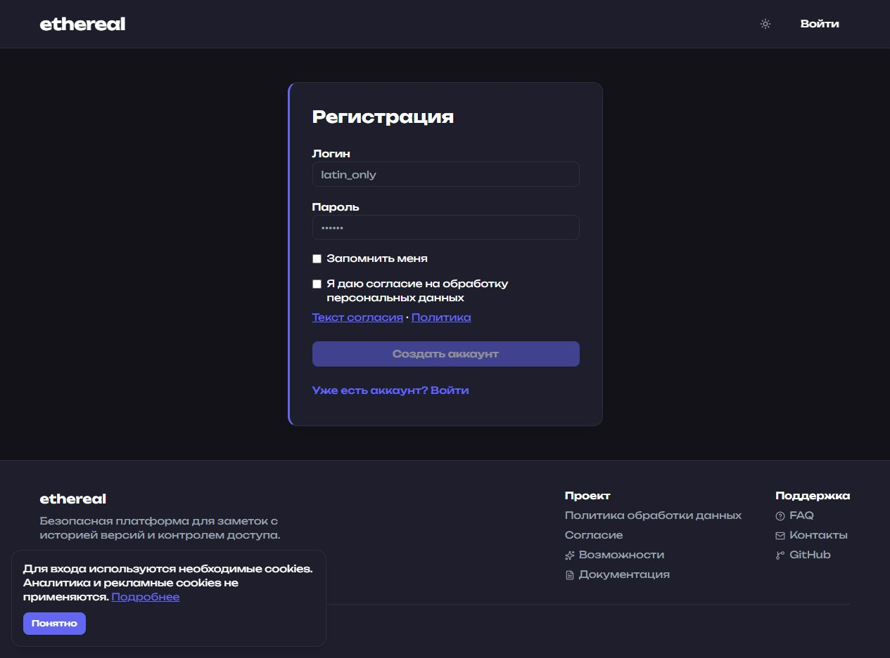
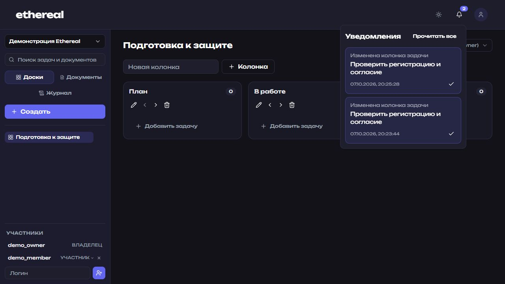
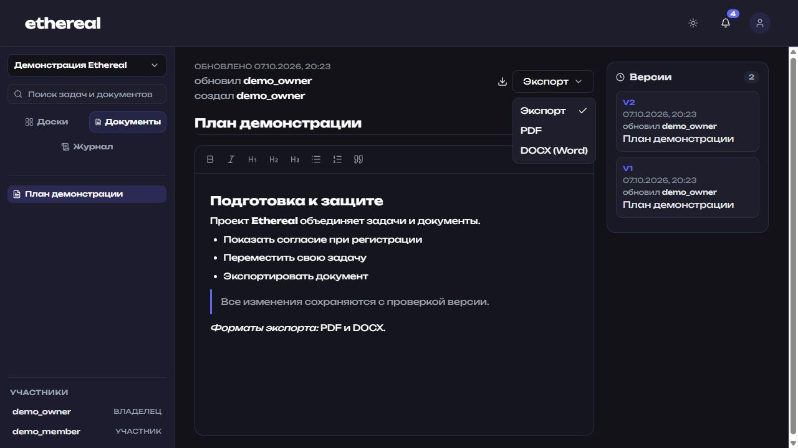

# Скриншоты и демонстрация

Реальные снимки интерфейса от 7 октября 2026 года, полученные на отдельной локальной демонстрационной БД. Данные и учётные записи в снимках вымышленные.

## Повторить

1. Запустить проект с отдельной тестовой PostgreSQL, чтобы демонстрация не добавлялась в рабочую БД. Backend автоматически применит миграции.
2. Установить зависимости backend и выполнить из корня `python backend/scripts/seed_demo.py --api http://127.0.0.1:8000`. Скрипт разрешает только локальный API, создаёт demo_owner/demo_member, пространство, доску с тремя колонками, задачи и документ с двумя версиями. Повторный запуск создаёт ещё одно демонстрационное пространство.
3. Открыть frontend на http://127.0.0.1:5173 (или адрес Docker frontend). На странице /login переключить форму на регистрацию; согласие изначально не отмечено.
4. Войти как demo_member, пароль Demo123!, выбрать «Демонстрация Ethereal». Переместить свою задачу через меню текущей колонки. Снять канбан.
5. Выйти и войти как demo_owner с тем же демонстрационным паролем. Выбрать демонстрационное пространство, открыть документ «План демонстрации», снять редактор и версии.
6. Открыть колокольчик, снять историю перемещений. В документе открыть «Экспорт» и снять меню PDF / DOCX; проверить оба скачивания.
7. Сохранить JPEG-снимки в docs/screenshots с указанными ниже именами, скопировать их в frontend/public/screenshots. Не включать настоящие логины, ключи или рабочие тексты.

## Регистрация

Отдельная галочка согласия, ссылки на политику и текст согласия, опция запоминания и уведомление о необходимых cookies.

## Канбан участника

Участник видит свои задачи и перемещает их выбором колонки; управление содержимым недоступно.

## Редактор и версии

Форматирование документа, статус автосохранения и история двух редакций.

## Уведомления

Личная история перемещений задач, счётчик и управление прочитанностью.

## Экспорт

Оба формата доступны читателю документа. Экспортируется сохранённая редакция, черновик сохраняется перед выгрузкой.
